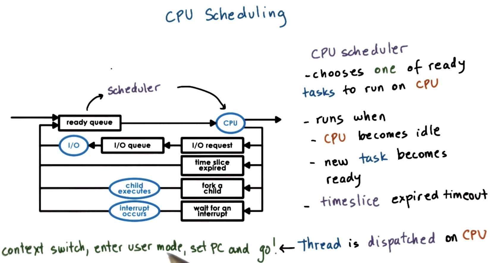
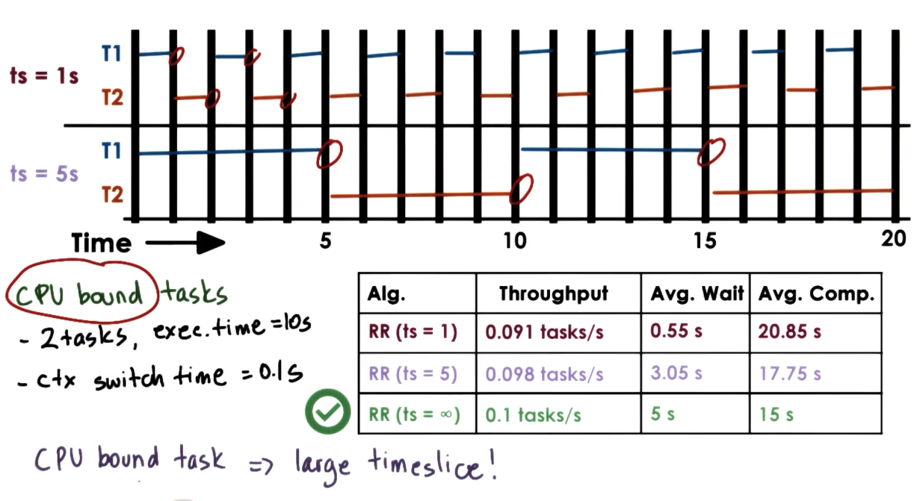
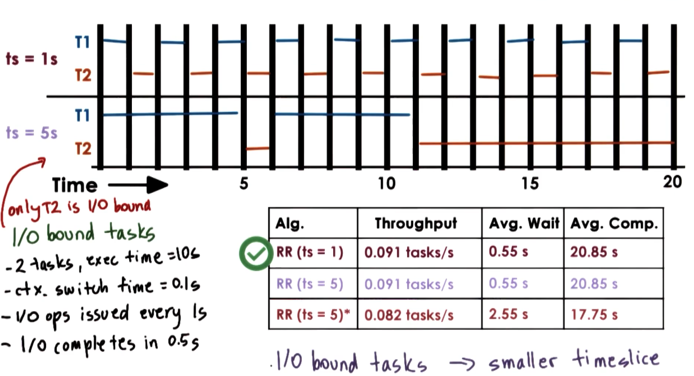
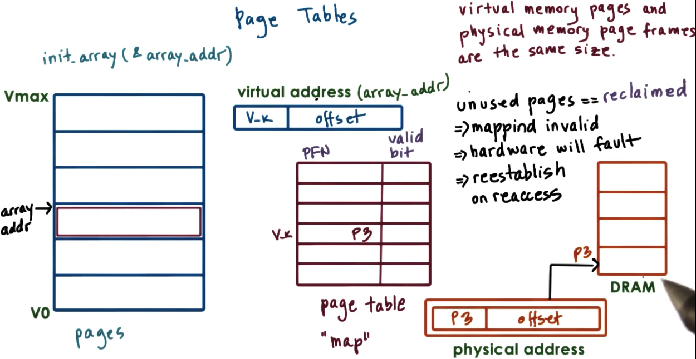
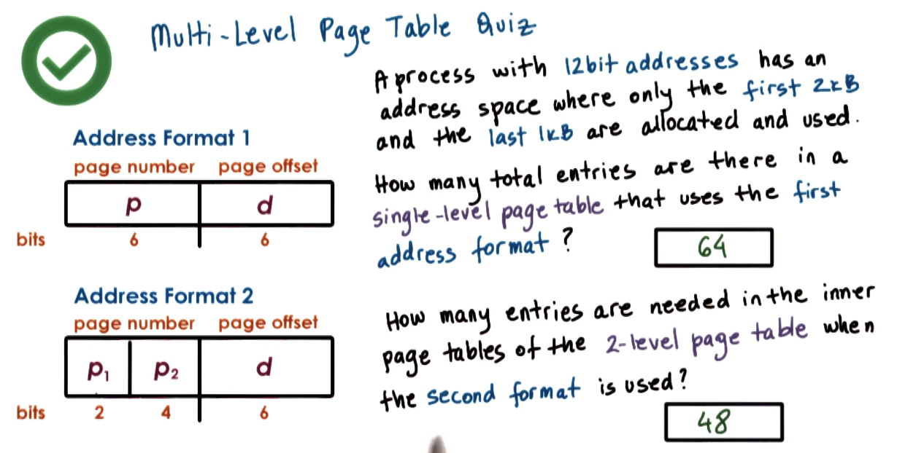
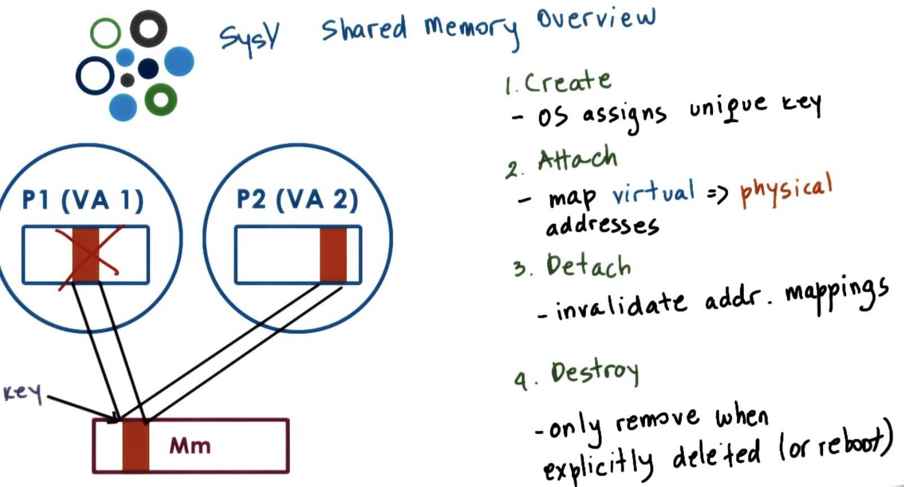
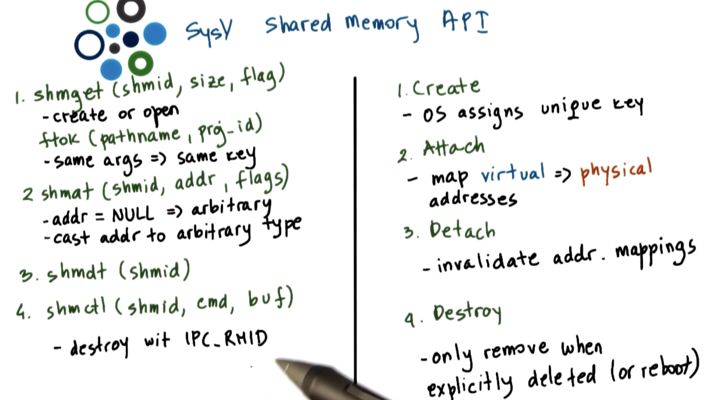

# p3

 scheduler , scheduling algo, complete fair schedular, off one schedular, multi cpu scheduling (paper)

 Visual Metaphor - OS scheduler like like a toy shop manager, schedules work

- dispatch task immediately?
    - simple! (FIFO, FCFS) 
    - no need to analyze the incoming workload

- dispatch simple order first?
    - maximize the # of order processed over time
    - maximize throughput (shortest job first)

- dispatch complex order first?
    - maximize the resources busy
    - maximize the utilization of cpu, devices, memory

 all are possible options, but the strategy is depend on how the manager wants to manage the shop and utilize the resources.


##  L1 CPU scheduling



choose task for ready queue (task == task == thread)

depend on which policy, algorithm and how the runque runqueue data structure is implemented.

### run-to-completion

t1 = 1sec , t2 = 10sec, t3 = 1sec
#### FCFS 
schedule in order of arrival
t1 -> t2 -> t3

runqueue == queue (FIFO)

throughput = jobs_completed / time_to_complete_all_job
3/12s = 0.25 task/second

avg completion time  = sum_of_times_to_complete_each_job / jobs_completed
(1 + 11 + 12) /3 = 8 sec

avg wait time = (t1_wait_time + t2_wait_time + t3_wait_time) / jobs_completed
(0 + 1 + 11)/3 = 4 sec

##### SJF
schedule tasks in order of their execution time
t1 -> t3 -> t2

runqueue == ordered queue (tree)

throughput = 3/12s = 0.25/task/sec

avg completion time = (1 + 2 + 12)/3 = 15/3 = 5sec

avg wait time (0 + 1 + 2)/3 = 1 

##### SJF with preemptive scheduling
###### task can be stopped to let shorter jobs run first

task, exec_time, arrival_time
t1, 1, 2
t2, 10, 0
t3, 1, 2

herustic based on history => job running time
- how long did a task run last time?
- how long di a task run last n time? ( windowed average)

###### task can be stopped to let higher priority jobs run first


like os task > user level priority

| Task | Exec Time | Arrival Time | Priority |
|------|-----------|--------------|----------|
| T1   | 1 sec     | 2            | 1        |
| T2   | 10 sec    | 0            | 2        |
| T3   | 1 sec     | 2            | 3        |


1 runqueue for each priority, or ordered tree by priority

low priority task can stuck in starvation. we can use "priority aging" => priority = f(actual priority, time spent in run queue)


```
quiz
                       3
t1                 --------|
               2              2
t2          -------        -------|
       3
t3 ---------                       ----|
   0  1  2  3  4  5  6  7  8  9  10  11
```

#### 9. Priority Inversion
when a lower priorty task has lock that a higher priority task needs

solution: temp boost priority of mutex owner, lower again on release.

#### 10. round robin scheduling
FCFS, but when task is waiting, it will move to next task.

can also include priority, but that will introduce preemption.

roundrobin w/ interleaving, timeslicing, cycle through each task with a given timeslice.

#### 11. Timesharing and Timeslices
- timeslice == max amount of uninterrupted time given to a task aka time quantum

- may run less than full timeslicetime
    - preempted
    - wait on I/O

- using timeslice, tasks are interleaved, timesharing the CPU.


pro of timeslice scheduling
- as simple as FCFS
- shortest task finish sooner
- more responsive
- lengthy I/O ops initiated sooner

con: 
- overhead: interrupts, schedule, context switch
- keep timeslice >> context switch time

so how long should a timeslice be?  
we need to balance benefits and overheads  

#### CPU BOUND TASK

Timeslice = 1 second
throughput = 2 / (10 + 10 + 19*0.1) = 0.091 tasks/second
avg. wait time = (0 + (1+0.1)) / 2 = 0.55 seconds
avg. comp. time = 21.35 seconds
Timeslice = 5 seconds
throughput = 2 / (10 + 10 + 3*0.1) = 0.098 tasks/second
avg. wait time = (0 + (5+0.1)) / 2 = 3.05 seconds
avg. comp. time = 17.75 seconds
Timeslice = ∞
throughput = 2 / (10 + 10) = 0.1 tasks/second
avg. wait time = (0 + (10)) / 2 = 5 seconds
avg. comp. time = (10 + 20)/2 = 15 seconds



CPU bound prefer large timeslice, user only care about completion time.
- limit context switch time
- keep cpu utilization and throughput high

#### I/O bound task

for Timeslice = 1sec
avg. comp. time = (21.9 + 20.8) / 2 = 21.35
Timeslice = 5 second*
throughput = 2 / 24.3 = 0.082 tasks/second
avg. wait time = 5.1 / 2 = 2.55 seconds
avg. comp. time = (11.2 + 24.3) / 2 = 17.75 seconds



I/O is better with smaller timeslice
- issue I/O asap
- keep CPU and device utilization high
- better user-perceived performance

#### timeslice quiz
```
t1 

t2

t3

t4

t5

t6

t7

t8

t9

t10   - 

t11 -  
    0  1  2  3  4  5  6  7  8  9  10 11 12 13


10 I/O, every 1ms issue I/O op (10ms to complete)

1 CPU 

context_switch = 0.1ms

CPU Utilization = [cpu_running_time / (cpu_running_time + context_switching_overheads)] * 100

1ms/1ms + 0.1ms = 91%

10 * 1ms + 1*10ms / (10*1 + 10*0.1 1*10 + 1*0.1 ) = 95%
```

#### 17. Runqueue Data Structure

different queue for different timeslice

- I/O intensive = highest priority
- medium I/O intensice = medium priority
- CPU intensive = low priority

so how do we know what they are?, based on history, what about new tasks?

##### multi level feedback queue
let's move tasks around into different queue based on it's historic execution time. if takes longer, move to longer timeslice queue. if shorter, likely I/O move to higher priority.

#### 18. Linux O(1) scheduler, 
- 140 priority level
- 0-99 are real time, 100 - 140 are other tasks
- priority + - 5 based on sleep time

active tasks list are current running tasks, task remain in active queue until timeslice expires

expired array store tasks that are moved from active.  
at the end the two list are swapped, so lower priority will get a chance to run again. aging mechanism  
introduced in 2.5 by ingo molnar, replaced by complete fair schedular 2.6.23 

con with O(1):
- performance of interactive tasks, have to wait unpredictable amount of time
- no fairness guarantee


#### 19. Linux CFS Scheduler

- default since 2.6.23 to replace O(1)
- runqueue == red-black tree, self balance tree
- run left most node
- time pass slower for high-priority, faster for low priority

performance:
- select task O(1)
- add task O(lg(n))

#### 21. Scheduling on Multiprocessors

multi cpu: multiple cpu
multi core : laptop

cache affinity - schedule task on same cpu to likely have states

per cpu runqueue and scheulder, new incoming tasks are placed onto a cpu's queue

numa(non-uniform memory access) aware scheduling - keep tasks on cpu closer to mm nodes where state is.

https://s3.amazonaws.com/content.udacity-data.com/courses/ud923/references/ud923-fedorova-paper.pdf

#### 22. Hyperthreading (smt) simultaneous multithreading up to 8
the context switching is very fast because cpu have many registers.

so how do we manage co schedule:

- schedule the cpu and memory intesive tasks.
- how do we know what's cpu and memory task
    - hardware counters will store info, useful for resource management
    - oprofile, linux tool


#### 25. Scheduling with Hardware Counters 
- CPI (cycle per instruction)
- memory bound => high CPI


## L2 memory management

### concepts and mechanism for physical and virtual memory

- use intelligently sized containers
    - pages or segments
- not all memory is needed at once
    - task needed on subset of memory
- optimized for performance
    - reduce time to access state in memory

### goals:

Virtual vs physical memory: os abstraction + hardware support

- Allocate:
    - allocation, replacement

- Arbritrate
    - address translation and validation

Paged based memory management - more popular
- pages -> page frames
- page tables

segment based mm
- segments
- segment registers


#### hardware support
mmu comes with cpu package
- translate virtual to physical address
- report faults

registers
- pointers to page tables
- base and limit size, num of segments

cache - translation lookaside buffer (TLB)
- valid va - pa translation

translation
- actual PA generation done in hardware 

### page tables 
maps v0 - vmax maps to page



per process, on context switch, switch to valid page table

page table entry:
- page frame number(PFN)
- present
- dirty
- accessed
- r/w
- u/s

when something bad happens when access memory, these steps happen
1. generate error code on kernel stack 
2. trap into kernel
3. page fault handler: determines actions based on error code and faultign addr

page table size can get out of hand real quicky, so let's find clever ways to identify them.


### hierarchical page tables
multi level page map, more map = more smaller pages = more likely fully utilized, trade off is more map level latency lookup



#### overhead of address translation

page table cache (translation lookaside buffer)

#### hashing page tables

#### segmentation

#### how large is a page?

10 bit offset -> 1kb page size

### how to allocate memory?
memory allocator
- determine va to pa mapping, check if valid

kernel-level allocators
- kernel state
- static process state

user-level allocator
- dynamic process state (heap); malloc/free

#### memory allocation challenge
to limit external segementation/ large gap

buddy allocator:subdivide into 2^x chunks
- aggregation works well and fast

slab allocator
- size = kernel object to avoid segmentation

#### demand paging
- pages swapped in/out of memory with disk
- can disable swapping

when to free?
- memory usage is above threshold (high watermark)
- when cpu usage is below threshold

which to be free?
- pages that wont be used
- history based prediction
    - LRU
    - accessbit to trakc if page is referenced
- pages that dont need to be written out
    - dirty bit to track if modified
- avoid non-swappable pages

in linux:
- target page count
- categorize pages into diff types:
    - claimable, swappable
- second chance, variation of lru

#### benefit of mmu hardware features

cow (copy on write)
- only copy page on write op, when read op, just point to same page
- ex: create new parent thread

checkpoint
- debugging
    - rewind
- migration
    - continue on another machine
    - disaster recovery
    - consolidation


### IPC

### metaphore
- share memory
- message passing via sockets
- mutex, waiting sync

how?
- via message passing : socket, msg queue
- memory based - shared memory, memory mapped file
- higher level, file, rpc

### message passing
os provide channel to send/recv
- pro: easy to implement
- con: many over head 4x cross kernel

pipes - connect output of p1 into p2

msg queue - socket()


### shared memory IPC
read write to shared memory region

- pro: fast
- con: need to sync,expensive setup pass

APIS: sysvapi, posix api, android ashmem, memory mapped files

trade off is
- message use copy
    - cpu to copy everytime
    - large data is better
- shared memory use map
    - cpu has overhead to map memory into address space
    - setup once, use manytime

window use lpc to determine data size and pick method.


#### sysv shared memory api



#### l10



#### posix shared memory API
use file instead of segment, use fd instead of key   

- shm_open()
    - return fd
    - in 'tmpfs"
- mmap() and unmap()
- shm_close()
- shm_unlink()

https://man7.org/linux/man-pages/man7/shm_overview.7.html


#### sync methods
mutex, cond var 

pthreads sync for IPC
```c
// shm

// shm segment

// create and init mutex

```
sysv ipc tutorial - https://tldp.org/LDP/lpg/node21.html

mq notify() man page - https://man7.org/linux/man-pages/man3/mq_notify.3.html
- registers for notification when a message is available

sem_wait(), shm_overview

https://www.tutorialspoint.com/inter_process_communication/inter_process_communication_message_queues.htm


#### considerations

- 1 large segment - manage alloc/freeing
- many small segments - segment identifier


- large sgement  - one shot
- small segments - many rounds 

## C notes
semaphore - unsinged int, atomic op 

```
wait() == grab lock
//critical section
post()

```
strace - syscall trace


ltrace - lib call trace


```
brk - move program break above the heap

mmap - request more memory, memory map
```

How to Map Files into Memory in C (mmap, memory mapped file io)
```c


```

memcopy - copy from one memory to another

strcopy - copy string until a null terminator
strncopy - copy string until a null terminator, atmost n bytes


```c
// associate memory with a file

ftok() -> get key associated with a file name
shmget() -> get shared memory block id based on key
shmat() -> map block id into a process 


```


